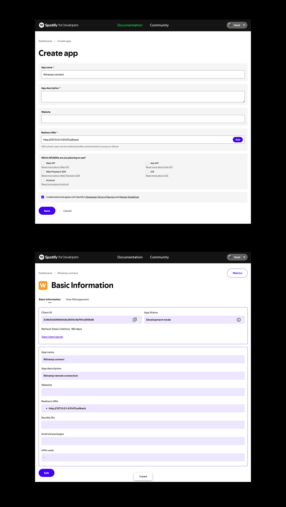
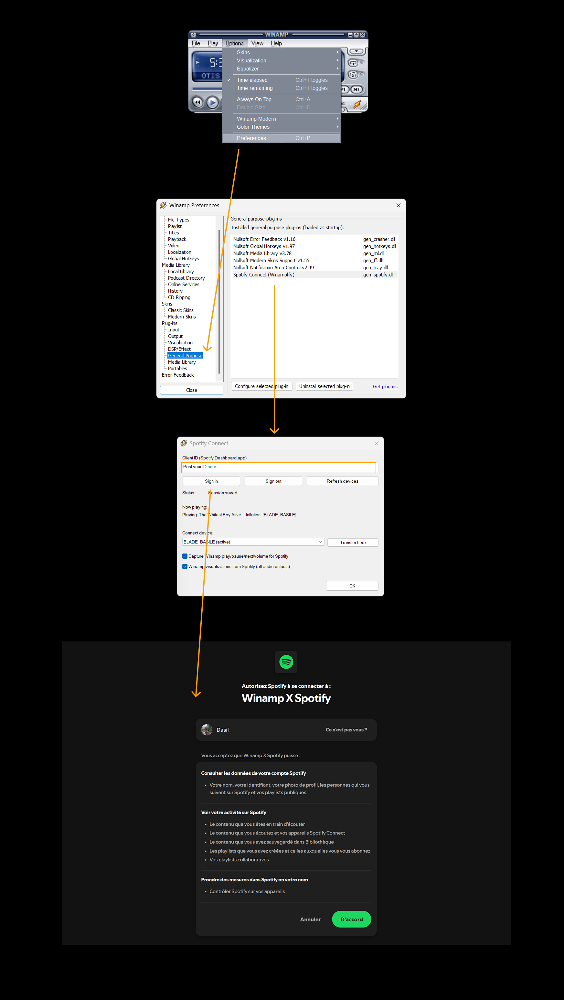
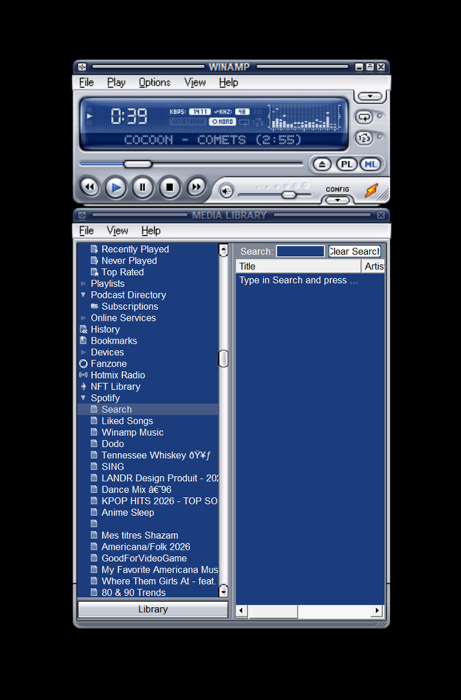

# Winamplify — Control Spotify from Winamp

Love Winamp. Love Spotify. **Winamplify** puts them together: drive **Spotify Connect** with the classic Winamp player you already know, play, pause, next, volume, seek, while your music still streams from Spotify Desktop.

Browse **Liked Songs** and your playlists in the Media Library, fire up Milkdrop / AVS / skin visuals synced to Spotify’s output, and keep the Winamp workflow without leaving Spotify’s catalog.

Works with **Winamp 5.9.2 (32-bit)** and **Spotify Premium**. Audio stays in Spotify (no double playback); Winamp visualizations use a Windows audio loopback.

## What it does

- `gen_spotify.dll` — login, Connect devices, play/pause/next/prev/volume/seek (Winamp buttons).
- `in_winamplify.dll` — dummy decoder `winamplify://vis`: Winamp thinks it is playing, and visualizations (Milkdrop / AVS / skin) receive **Windows audio** (Spotify).
- `ml_spotify.dll` — **Spotify** node in the media library: Liked Songs + your playlists, double-click to play.

Each user signs in **with their own account**. The Client ID is the **app** identity from the Spotify Dashboard (not a Spotify password).

---


## How to setup


### 1. Install Winamp

Download and install **Winamp 5.9.2 (32-bit)** from the official site:

**[winamp.com](https://www.winamp.com/)**

Use the 32-bit installer. This plugin does not work with a 64-bit player.

### 2. Copy the three plugins into Winamp

Download these three files from `[dist/](https://github.com/BasileFromSouth/Winamplify/tree/main/dist)` (no build required):

- `[gen_spotify.dll](https://github.com/BasileFromSouth/Winamplify/raw/main/dist/gen_spotify.dll)`
- `[ml_spotify.dll](https://github.com/BasileFromSouth/Winamplify/raw/main/dist/ml_spotify.dll)`
- `[in_winamplify.dll](https://github.com/BasileFromSouth/Winamplify/raw/main/dist/in_winamplify.dll)`

Paste them into:

`C:\Program Files (x86)\Winamp\Plugins\`

If you cloned the repo, you can copy the folder instead:

```powershell
Copy-Item .\dist\*.dll "C:\Program Files (x86)\Winamp\Plugins\"
```

Or: `powershell -File scripts\install.ps1`

Restart Winamp. Remove leftover `in_wamplify.dll` / `in_loosamp.dll` if they are still in that folder.

### 3. Create a Spotify app and paste the Client ID

1. Open the [Spotify Developer Dashboard](https://developer.spotify.com/dashboard) (free; not a paid “developer” subscription) and **Create app**.
2. Add this **Redirect URI** exactly, then click **Add** and **Save**:
  `http://127.0.0.1:43147/callback`
3. Copy the **Client ID** only (not the Client Secret).



1. In Winamp: **Options → Preferences → Plug-ins → General Purpose → Spotify Connect (Winamplify) → Configure**.
2. Paste the Client ID → **Sign in** → authorize in the browser.
3. Open **Spotify Desktop**, start a track once, then **Refresh devices** / **Transfer here**.



### 4. Open Spotify in the Media Library

After sign-in, the Media Library has a **Spotify** node (Liked Songs and your playlists). Double-click a track to play it on Spotify Connect.

Click **ML** on the Winamp main window if the library is hidden.



---


## Spotify limit (2026)

In **development mode**, **5 accounts** max per Client ID (Dashboard allowlist). Unlimited extended quota is for **companies** (~250k MAU) — not a personal plugin.

- **You + a few friends:** one app, add their emails.
- **Wider sharing:** each person creates **their** Dashboard app and pastes **their** Client ID in the plugin prefs. As of 2026 Spotify only allows **5 users** per app in dev mode (no longer 25).

Optional (developers): copy `plugin/common/client_id.h.example` to `plugin/common/client_id.h` and put the Client ID there to prefill the field (do not commit that file). Shared DLLs stay empty unless you do this.

## Build (Visual Studio 2019+, Win32)

```bat
msbuild winamplify.sln /p:Configuration=Release /p:Platform=Win32
```

(Optional CMake: `cmake -S . -B build -A Win32` then `cmake --build build --config Release`.)

The three DLLs are copied automatically to `dist\`.

## Prefs

- **Capture Winamp play/pause/next/volume for Spotify**: when checked and signed in, the player buttons drive Connect instead of the local playlist.
- **Winamp visualizations from Spotify**: captures **all** active Windows audio outputs (headphones, HDMI, speakers, etc.) and feeds AVS / Milkdrop / the skin vis. Spotify can play on any device.


## Local files

Tokens: `%AppData%\Winamp\Plugins\spotify\` (never inside the DLL).

## Out of scope

Decoding Spotify audio inside Winamp (Winamp EQ, DSP). macOS.